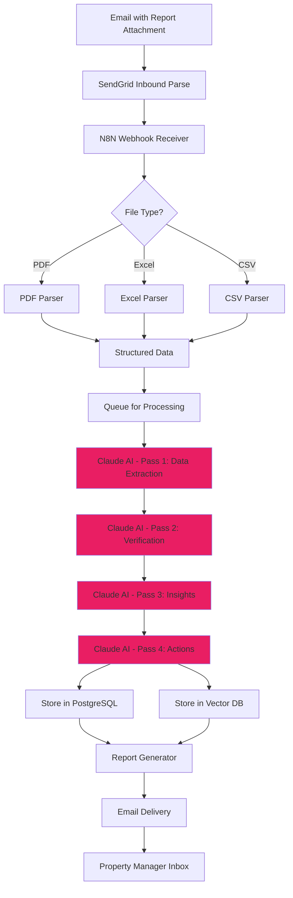
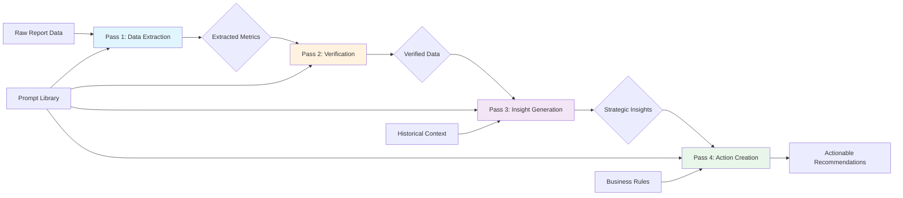
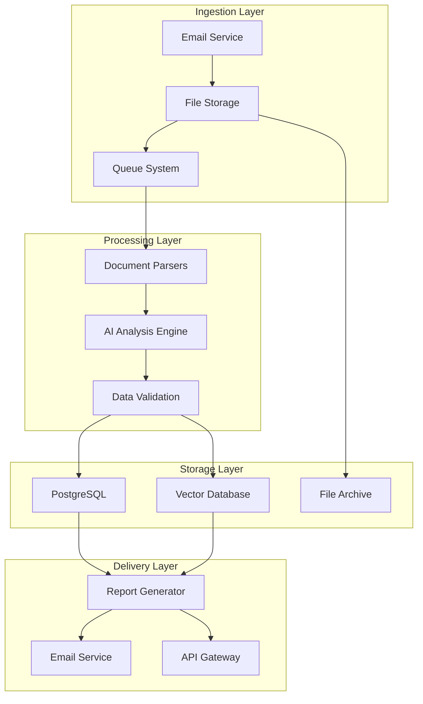
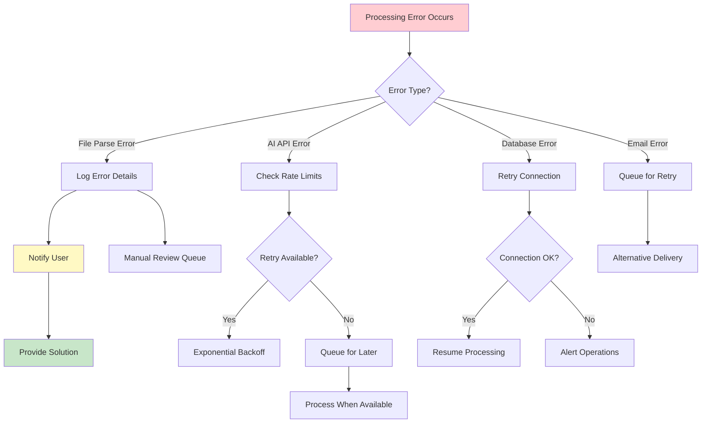
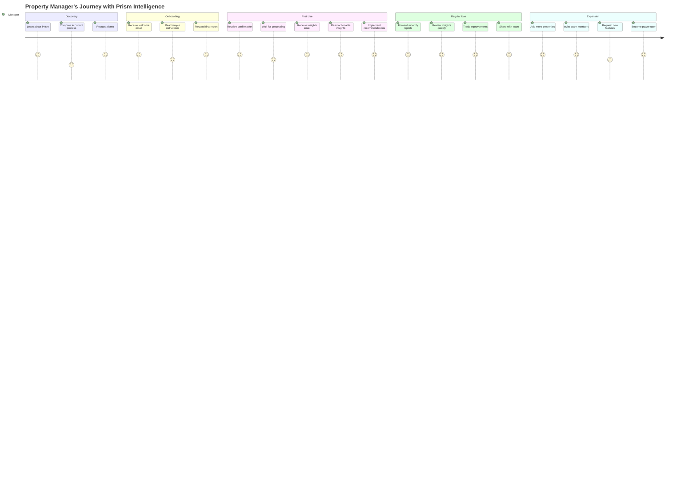
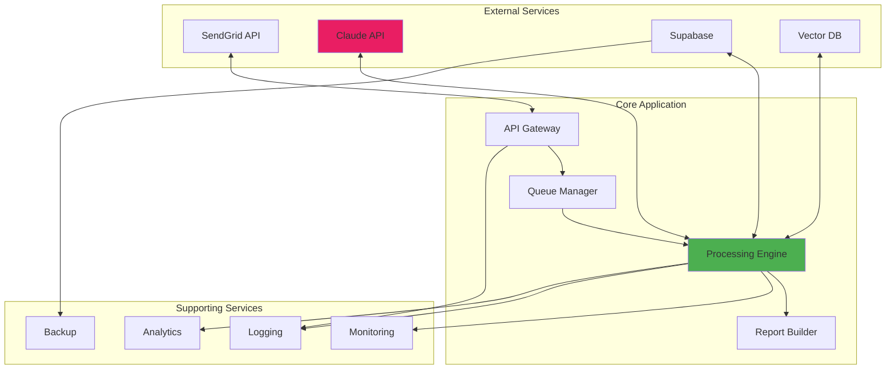

# Prism Intelligence Workflow Diagrams

## System Overview

This document provides visual representations of how Prism Intelligence processes property management reports from ingestion through delivery. These diagrams help stakeholders understand the system flow and technical teams implement the architecture correctly.

## Main Processing Workflow

## Multi-Pass AI Analysis Detail

Understanding how the four-pass AI analysis works is crucial to appreciating why Prism Intelligence delivers such superior results compared to traditional reporting tools. Each pass builds upon the previous one, creating layers of understanding that mirror how a skilled analyst would approach a complex report.

## Data Flow Architecture

The system architecture separates concerns elegantly, ensuring each component has a single responsibility while maintaining seamless communication between services. This design enables horizontal scaling and easy maintenance as the system grows.

## Error Handling and Recovery Flow

Robust error handling ensures the system gracefully manages failures without losing data or leaving users in the dark. Every potential failure point has a recovery strategy, maintaining system reliability even under adverse conditions.

## User Journey Flow

Understanding the user's journey through the system helps ensure we're building something that truly serves their needs. From the moment they forward a report to receiving actionable insights, every step should feel natural and valuable.

## Technical Component Integration

The beauty of Prism Intelligence lies not just in its individual components, but in how elegantly they work together. Each service communicates through well-defined interfaces, creating a symphony of data processing that appears effortless to the end user.

## Summary

These workflow diagrams provide a visual understanding of how Prism Intelligence transforms property management reports into actionable insights. From the moment an email arrives to the delivery of strategic recommendations, every step is designed for reliability, scalability, and value creation. Use these diagrams as reference guides during implementation and as communication tools when explaining the system to stakeholders.