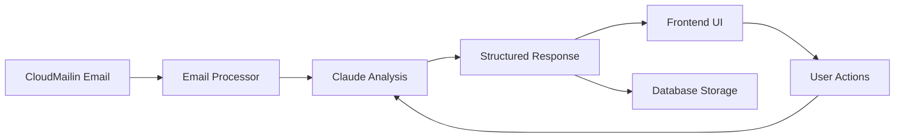

# Claude AI Integration Guide - Property Intelligence Platform

> **Last Updated**: December 28, 2024  
> **Claude Version**: Claude 3.5 Sonnet  
> **Integration Type**: AI Agent for Property Management Analysis  
> **Platform**: Property Intelligence Platform

---

## 📋 Table of Contents

1. [Overview](#overview)
2. [Claude Integration Architecture](#claude-integration-architecture)
3. [Setup & Configuration](#setup--configuration)
4. [Prompt Engineering](#prompt-engineering)
5. [Context Management](#context-management)
6. [API Usage Patterns](#api-usage-patterns)
7. [Property Management Prompts](#property-management-prompts)
8. [Error Handling](#error-handling)
9. [Performance Optimization](#performance-optimization)
10. [Best Practices](#best-practices)
11. [Examples](#examples)
12. [Troubleshooting](#troubleshooting)

---

## 🤖 Overview

### What Claude Does in Our Platform

Claude serves as the **intelligent analysis engine** for property management data, transforming raw emails and attachments into actionable insights:

- **📧 Email Analysis**: Processes property management emails from CloudMailin
- **💰 Financial Intelligence**: Extracts and analyzes financial metrics
- **🏢 Property Insights**: Generates operational recommendations
- **⚡ Action Items**: Creates prioritized task lists
- **📊 Trend Analysis**: Identifies patterns across multiple reports
- **🔍 Anomaly Detection**: Flags unusual patterns or concerns

### Integration Points



---

## 🏗️ Claude Integration Architecture

### System Components

```
Property Intelligence Platform
├── Frontend (Next.js)
│   ├── Email Processing UI
│   ├── Analysis Dashboard
│   └── Claude Chat Interface
├── Backend API
│   ├── Claude Service Layer
│   ├── Email Processing Pipeline
│   └── Context Management
├── Claude AI Integration
│   ├── Property Analysis Agent
│   ├── Financial Metrics Extractor
│   ├── Insight Generator
│   └── Action Item Creator
└── Data Layer
    ├── Email Storage
    ├── Analysis Results
    └── Context History
```

### Claude Roles in Our Platform

1. **📊 Property Analyst**: Analyzes financial and operational data
2. **🧠 Insight Generator**: Creates actionable business intelligence
3. **📝 Report Summarizer**: Converts complex data into clear summaries
4. **🎯 Action Planner**: Generates prioritized task recommendations
5. **🔍 Pattern Detector**: Identifies trends and anomalies
6. **💬 Interactive Assistant**: Answers user questions about properties

---

## ⚙️ Setup & Configuration

### Environment Variables

```bash
# Claude API Configuration
ANTHROPIC_API_KEY=your_claude_api_key_here
CLAUDE_MODEL=claude-3-sonnet-20240229
CLAUDE_MAX_TOKENS=4000
CLAUDE_TEMPERATURE=0.3

# Property Intelligence Specific
PROPERTY_ANALYSIS_MODE=comprehensive
FINANCIAL_PRECISION=high
INSIGHT_DEPTH=detailed
ACTION_PRIORITY_LEVELS=5

# Context Management
MAX_CONTEXT_MESSAGES=20
CONTEXT_WINDOW_SIZE=100000
PROPERTY_MEMORY_ENABLED=true
```

### Claude Service Configuration

```typescript
// src/services/ClaudeService.ts
interface ClaudeConfig {
  apiKey: string;
  model: 'claude-3-sonnet-20240229' | 'claude-3-opus-20240229';
  maxTokens: number;
  temperature: number;
  propertyAnalysisMode: 'basic' | 'comprehensive' | 'detailed';
  contextManagement: {
    enabled: boolean;
    maxMessages: number;
    windowSize: number;
  };
}

export class ClaudeService {
  private config: ClaudeConfig;
  private contextManager: ContextManager;
  private promptLibrary: PropertyPromptLibrary;
  
  constructor(config: ClaudeConfig) {
    this.config = config;
    this.contextManager = new ContextManager(config.contextManagement);
    this.promptLibrary = new PropertyPromptLibrary();
  }
}
```

---

## 🎯 Prompt Engineering

### Core Prompt Templates

#### 1. **Property Financial Analysis Prompt**

```typescript
const FINANCIAL_ANALYSIS_PROMPT = `
You are a senior property management analyst with 15+ years of experience. 

Analyze this property financial data and provide insights:

PROPERTY: {propertyName}
PERIOD: {reportPeriod}
DATA: {financialData}

Provide analysis in this exact JSON format:
{
  "summary": "Brief 2-sentence summary of financial performance",
  "keyMetrics": {
    "revenue": number,
    "expenses": number,
    "noi": number,
    "occupancy": decimal,
    "capRate": decimal,
    "variance": {
      "revenueChange": percent,
      "expenseChange": percent
    }
  },
  "insights": [
    "Key insight 1 (specific and actionable)",
    "Key insight 2 (trend or pattern identified)",
    "Key insight 3 (risk or opportunity)"
  ],
  "actions": [
    {
      "task": "Specific action item",
      "priority": 1-5,
      "timeframe": "immediate|short|medium|long",
      "rationale": "Why this action is needed"
    }
  ],
  "alerts": [
    {
      "type": "warning|opportunity|risk",
      "message": "Alert description",
      "urgency": "low|medium|high|critical"
    }
  ]
}

ANALYSIS GUIDELINES:
- Focus on actionable insights, not just data repetition
- Identify trends by comparing to typical property metrics
- Flag any unusual patterns or concerning metrics
- Prioritize actions by potential impact and urgency
- Use property management industry standards for benchmarking
`;
```

#### 2. **Email Classification Prompt**

```typescript
const EMAIL_CLASSIFICATION_PROMPT = `
Classify this property management email and extract key information:

EMAIL SUBJECT: {subject}
FROM: {sender}
CONTENT: {emailBody}
ATTACHMENTS: {attachmentList}

Classify as JSON:
{
  "emailType": "financial_report|lease_document|maintenance_request|tenant_communication|vendor_invoice|other",
  "priority": 1-5,
  "propertyIdentified": "property name or null",
  "reportPeriod": "identified period or null",
  "keyTopics": ["topic1", "topic2", "topic3"],
  "requiresAttention": boolean,
  "nextActions": ["action1", "action2"],
  "confidenceScore": 0.0-1.0
}

Be precise and conservative in classification.
`;
```

#### 3. **Lease Analysis Prompt**

```typescript
const LEASE_ANALYSIS_PROMPT = `
You are a commercial lease analyst. Review this lease document/communication:

CONTENT: {leaseContent}
PROPERTY: {propertyName}

Extract critical information:
{
  "leaseDetails": {
    "tenant": "tenant name",
    "unit": "unit identifier",
    "leaseStart": "date",
    "leaseEnd": "date",
    "rentAmount": number,
    "escalations": "escalation terms",
    "renewalOptions": "renewal details"
  },
  "criticalDates": [
    {
      "date": "YYYY-MM-DD",
      "type": "expiration|renewal_notice|rent_increase|other",
      "description": "what happens on this date",
      "daysUntil": number,
      "urgency": "low|medium|high"
    }
  ],
  "risks": [
    {
      "risk": "description of risk",
      "impact": "financial impact if applicable",
      "mitigation": "suggested action"
    }
  ],
  "opportunities": [
    "opportunity description"
  ]
}
`;
```

### Prompt Optimization Guidelines

1. **Specificity**: Always include exact output format requirements
2. **Context**: Provide relevant property management context
3. **Examples**: Include few-shot examples for complex tasks
4. **Constraints**: Set clear boundaries for analysis scope
5. **Validation**: Include confidence scoring for AI responses

---

## 🧠 Context Management

### Context Strategy

```typescript
interface PropertyContext {
  propertyId: string;
  propertyName: string;
  recentEmails: ProcessedEmail[];
  financialHistory: FinancialReport[];
  leaseInformation: LeaseData[];
  maintenanceHistory: MaintenanceRecord[];
  marketContext: MarketData;
  aiMemory: {
    previousInsights: string[];
    ongoingConcerns: string[];
    trackedMetrics: MetricHistory[];
  };
}

class ContextManager {
  private contexts: Map<string, PropertyContext> = new Map();
  
  buildContextForProperty(propertyId: string): string {
    const context = this.contexts.get(propertyId);
    if (!context) return '';
    
    return `
PROPERTY CONTEXT FOR ${context.propertyName}:

RECENT FINANCIAL PERFORMANCE:
${this.formatFinancialHistory(context.financialHistory)}

CURRENT LEASES:
${this.formatLeaseInformation(context.leaseInformation)}

ONGOING CONCERNS:
${context.aiMemory.ongoingConcerns.join('\n')}

PREVIOUS AI INSIGHTS:
${context.aiMemory.previousInsights.slice(-5).join('\n')}

MARKET CONTEXT:
${this.formatMarketData(context.marketContext)}
    `;
  }
}
```

### Context-Aware Prompting

```typescript
const CONTEXT_AWARE_ANALYSIS = `
Given the property context above, analyze this new information:

NEW DATA: {newData}

Consider:
1. How does this compare to historical performance?
2. Are there patterns consistent with previous insights?
3. Do any ongoing concerns relate to this data?
4. What trends are emerging?

Provide analysis that builds on previous insights while identifying new patterns.
`;
```

---

## 🔄 API Usage Patterns

### 1. **Streaming Analysis for Large Reports**

```typescript
async function streamPropertyAnalysis(emailData: EmailData): Promise<void> {
  const stream = await claude.messages.create({
    model: 'claude-3-sonnet-20240229',
    max_tokens: 4000,
    temperature: 0.3,
    stream: true,
    messages: [
      {
        role: 'user',
        content: buildAnalysisPrompt(emailData)
      }
    ]
  });

  for await (const chunk of stream) {
    if (chunk.type === 'content_block_delta') {
      // Stream insights to frontend in real-time
      updateUIWithPartialInsight(chunk.delta.text);
    }
  }
}
```

### 2. **Batch Processing Multiple Properties**

```typescript
async function batchAnalyzeProperties(properties: PropertyData[]): Promise<BatchAnalysisResult> {
  const batchPrompt = `
Analyze these ${properties.length} properties simultaneously:

${properties.map((p, i) => `
PROPERTY ${i + 1}: ${p.name}
DATA: ${JSON.stringify(p.data)}
`).join('\n')}

Provide comparative analysis and identify:
1. Best performing property and why
2. Properties requiring immediate attention
3. Portfolio-wide trends
4. Cross-property optimization opportunities

Format as JSON array with analysis for each property plus portfolio summary.
`;

  return await claude.messages.create({
    model: 'claude-3-sonnet-20240229',
    max_tokens: 6000,
    messages: [{ role: 'user', content: batchPrompt }]
  });
}
```

### 3. **Interactive Q&A with Property Context**

```typescript
async function answerPropertyQuestion(
  propertyId: string, 
  question: string
): Promise<ClaudeResponse> {
  const context = contextManager.buildContextForProperty(propertyId);
  
  const conversationalPrompt = `
${context}

QUESTION: ${question}

Provide a helpful, specific answer based on the property context above. 
If the question requires analysis not available in the context, clearly state what additional information would be needed.

Keep responses concise but informative, and always relate back to actionable property management decisions.
`;

  return await claude.messages.create({
    model: 'claude-3-sonnet-20240229',
    max_tokens: 1500,
    temperature: 0.4,
    messages: [{ role: 'user', content: conversationalPrompt }]
  });
}
```

---

## 🏢 Property Management Prompts

### Financial Analysis Prompts

```typescript
const FINANCIAL_PROMPTS = {
  monthlyAnalysis: `
Analyze this monthly property financial report:
{reportData}

Focus on:
- Revenue trends vs previous months
- Expense categories requiring attention
- NOI performance and drivers
- Cash flow implications
- Variance explanations
`,

  budgetVariance: `
Compare actual vs budgeted performance:
ACTUAL: {actualData}
BUDGET: {budgetData}

Identify:
- Significant variances (>10%)
- Root causes of variances
- Forecast adjustments needed
- Action items to address gaps
`,

  portfolioSummary: `
Provide executive summary for property portfolio:
{portfolioData}

Generate:
- Portfolio-wide KPIs
- Top performing properties
- Properties requiring attention
- Strategic recommendations
- Market positioning insights
`
};
```

### Operational Analysis Prompts

```typescript
const OPERATIONAL_PROMPTS = {
  maintenanceAnalysis: `
Analyze maintenance report and trends:
{maintenanceData}

Evaluate:
- Recurring maintenance issues
- Cost trends by category
- Preventive vs reactive maintenance ratio
- Vendor performance
- Capital expenditure needs
`,

  occupancyAnalysis: `
Review occupancy and leasing data:
{occupancyData}

Assess:
- Occupancy trends and seasonality
- Lease expiration schedule
- Rental rate optimization opportunities
- Tenant retention strategies
- Market positioning
`,

  tenantCommunication: `
Analyze tenant communications for insights:
{tenantCommunications}

Extract:
- Common tenant concerns
- Satisfaction indicators
- Service improvement opportunities
- Potential retention risks
- Communication effectiveness
`
};
```

---

## ❌ Error Handling

### Claude API Error Management

```typescript
class ClaudeErrorHandler {
  static async handleAPICall<T>(
    apiCall: () => Promise<T>,
    retries: number = 3
  ): Promise<T | null> {
    for (let attempt = 1; attempt <= retries; attempt++) {
      try {
        return await apiCall();
      } catch (error) {
        if (error.type === 'rate_limit_error') {
          await this.waitForRateLimit(error.retry_after);
          continue;
        }
        
        if (error.type === 'overloaded_error' && attempt < retries) {
          await this.exponentialBackoff(attempt);
          continue;
        }
        
        if (attempt === retries) {
          this.logError(error, 'Final attempt failed');
          return null;
        }
      }
    }
    return null;
  }

  static async waitForRateLimit(retryAfter: number): Promise<void> {
    await new Promise(resolve => setTimeout(resolve, retryAfter * 1000));
  }

  static async exponentialBackoff(attempt: number): Promise<void> {
    const delay = Math.pow(2, attempt) * 1000; // 2s, 4s, 8s...
    await new Promise(resolve => setTimeout(resolve, delay));
  }
}
```

### Graceful Degradation

```typescript
async function analyzeWithFallback(emailData: EmailData): Promise<AnalysisResult> {
  // Try full Claude analysis first
  const claudeResult = await ClaudeErrorHandler.handleAPICall(
    () => performFullAnalysis(emailData)
  );
  
  if (claudeResult) {
    return claudeResult;
  }
  
  // Fallback to basic pattern matching
  console.warn('Claude analysis failed, using fallback');
  return {
    summary: extractBasicSummary(emailData),
    keyMetrics: extractBasicMetrics(emailData),
    insights: ['Analysis temporarily unavailable - using basic extraction'],
    actions: generateBasicActions(emailData),
    fallbackUsed: true
  };
}
```

---

## ⚡ Performance Optimization

### Caching Strategy

```typescript
class ClaudeAnalysisCache {
  private cache = new Map<string, CachedAnalysis>();
  
  async getOrAnalyze(
    emailHash: string, 
    emailData: EmailData
  ): Promise<AnalysisResult> {
    const cached = this.cache.get(emailHash);
    
    if (cached && !this.isStale(cached)) {
      return cached.result;
    }
    
    const fresh = await this.performAnalysis(emailData);
    this.cache.set(emailHash, {
      result: fresh,
      timestamp: Date.now(),
      ttl: 24 * 60 * 60 * 1000 // 24 hours
    });
    
    return fresh;
  }
}
```

### Prompt Optimization

```typescript
const OPTIMIZED_PROMPTS = {
  // Shorter, focused prompts for faster responses
  quickAnalysis: `
Property: {property}
Key metrics from {data}

Quick assessment:
1. Overall performance (1-5 scale)
2. Top concern
3. Next action
4. One-line summary

Format: JSON only, no explanation.
`,

  // Detailed prompts for comprehensive analysis
  deepAnalysis: `
[Full detailed prompt for thorough analysis when time allows]
`
};
```

---

## 🎯 Best Practices

### Prompt Design Best Practices

1. **Clear Output Format**: Always specify exact JSON schema
2. **Context Boundaries**: Define what information is available
3. **Validation Requests**: Ask Claude to assess its own confidence
4. **Industry Standards**: Reference property management benchmarks
5. **Action Orientation**: Focus on actionable insights

### Integration Best Practices

1. **Async Processing**: Never block UI for Claude responses
2. **Progressive Enhancement**: Show basic data immediately, enhance with AI
3. **User Feedback Loop**: Allow users to rate and correct AI insights
4. **Audit Trail**: Log all AI interactions for improvement
5. **Fallback Plans**: Always have non-AI alternatives

### Cost Management

```typescript
const COST_OPTIMIZATION = {
  // Use shorter prompts for routine analysis
  routineAnalysis: {
    maxTokens: 1500,
    temperature: 0.1
  },
  
  // Reserve detailed analysis for complex cases
  comprehensiveAnalysis: {
    maxTokens: 4000,
    temperature: 0.3
  },
  
  // Cache frequently requested analyses
  cacheStrategy: 'aggressive',
  
  // Batch similar requests
  batchProcessing: true
};
```

---

## 📝 Examples

### Complete Email Analysis Flow

```typescript
async function processPropertyEmail(email: EmailData): Promise<ProcessedEmail> {
  // 1. Extract basic information
  const classification = await claude.messages.create({
    model: 'claude-3-sonnet-20240229',
    max_tokens: 500,
    messages: [{
      role: 'user',
      content: EMAIL_CLASSIFICATION_PROMPT.replace('{subject}', email.subject)
        .replace('{sender}', email.from)
        .replace('{emailBody}', email.content)
        .replace('{attachmentList}', email.attachments.join(', '))
    }]
  });

  const classificationResult = JSON.parse(classification.content);

  // 2. If financial report, perform detailed analysis
  if (classificationResult.emailType === 'financial_report') {
    const context = await contextManager.buildContextForProperty(
      classificationResult.propertyIdentified
    );

    const analysis = await claude.messages.create({
      model: 'claude-3-sonnet-20240229',
      max_tokens: 3000,
      messages: [{
        role: 'user',
        content: `${context}\n\n${FINANCIAL_ANALYSIS_PROMPT}`
          .replace('{propertyName}', classificationResult.propertyIdentified)
          .replace('{reportPeriod}', classificationResult.reportPeriod)
          .replace('{financialData}', email.attachmentData)
      }]
    });

    return {
      id: generateId(),
      classification: classificationResult,
      analysis: JSON.parse(analysis.content),
      processedAt: new Date().toISOString(),
      confidence: classificationResult.confidenceScore
    };
  }

  // 3. Handle other email types...
  return basicProcessing(email, classificationResult);
}
```

### Interactive Property Q&A

```typescript
// User asks: "Why did expenses increase at Sunset Plaza last month?"
const answer = await claude.messages.create({
  model: 'claude-3-sonnet-20240229',
  max_tokens: 1000,
  messages: [{
    role: 'user',
    content: `
PROPERTY CONTEXT:
${contextManager.buildContextForProperty('sunset-plaza')}

USER QUESTION: "Why did expenses increase at Sunset Plaza last month?"

Based on the property context above, provide a specific answer about expense increases.
If the data shows an increase, explain the likely causes.
If no increase is evident, clarify what the data actually shows.
Always provide actionable next steps.
`
  }]
});
```

---

## 🔧 Troubleshooting

### Common Issues

#### 1. **Inconsistent Response Format**
```typescript
// Problem: Claude returns non-JSON responses
// Solution: Add format validation and re-prompt

async function ensureJSONResponse(prompt: string): Promise<object> {
  let attempts = 0;
  const maxAttempts = 3;
  
  while (attempts < maxAttempts) {
    const response = await claude.messages.create({
      model: 'claude-3-sonnet-20240229',
      max_tokens: 2000,
      messages: [{
        role: 'user',
        content: attempts === 0 
          ? prompt 
          : `${prompt}\n\nIMPORTANT: Respond with valid JSON only. Previous response was not valid JSON.`
      }]
    });
    
    try {
      return JSON.parse(response.content);
    } catch (e) {
      attempts++;
      if (attempts === maxAttempts) {
        throw new Error('Failed to get valid JSON after multiple attempts');
      }
    }
  }
}
```

#### 2. **Context Window Exceeded**
```typescript
// Problem: Too much context data
// Solution: Intelligent context trimming

function trimContextForClaude(context: PropertyContext): string {
  const maxContextSize = 50000; // characters
  let trimmedContext = '';
  
  // Prioritize recent and important information
  const priorities = [
    { data: context.ongoingConcerns, weight: 1.0 },
    { data: context.recentFinancials, weight: 0.8 },
    { data: context.criticalDates, weight: 0.9 },
    { data: context.historicalData, weight: 0.3 }
  ];
  
  priorities.sort((a, b) => b.weight - a.weight);
  
  for (const item of priorities) {
    const itemText = JSON.stringify(item.data);
    if (trimmedContext.length + itemText.length < maxContextSize) {
      trimmedContext += itemText + '\n';
    }
  }
  
  return trimmedContext;
}
```

#### 3. **Rate Limiting**
```typescript
// Problem: API rate limits hit during peak usage
// Solution: Queue management with priority

class ClaudeRequestQueue {
  private queue: QueueItem[] = [];
  private processing = false;
  private readonly maxConcurrent = 5;
  private readonly rateLimitDelay = 1000; // 1 second between requests
  
  async enqueue(
    request: ClaudeRequest, 
    priority: 'high' | 'medium' | 'low' = 'medium'
  ): Promise<ClaudeResponse> {
    return new Promise((resolve, reject) => {
      this.queue.push({
        request,
        priority,
        resolve,
        reject,
        timestamp: Date.now()
      });
      
      this.queue.sort((a, b) => {
        const priorityOrder = { high: 3, medium: 2, low: 1 };
        return priorityOrder[b.priority] - priorityOrder[a.priority];
      });
      
      this.processQueue();
    });
  }
}
```

### Debug Mode

```typescript
const DEBUG_MODE = process.env.CLAUDE_DEBUG === 'true';

function debugLog(operation: string, data: any): void {
  if (DEBUG_MODE) {
    console.log(`[Claude Debug] ${operation}:`, {
      timestamp: new Date().toISOString(),
      data: JSON.stringify(data, null, 2)
    });
  }
}

// Usage
debugLog('Prompt Sent', { prompt: finalPrompt, tokens: promptTokens });
debugLog('Response Received', { response: claudeResponse, tokens: responseTokens });
```

---

## 📊 Monitoring & Analytics

### Usage Tracking

```typescript
interface ClaudeUsageMetrics {
  totalRequests: number;
  averageResponseTime: number;
  tokenUsage: {
    input: number;
    output: number;
    total: number;
  };
  errorRate: number;
  successfulAnalyses: number;
  userSatisfactionScore: number;
}

class ClaudeMonitor {
  private metrics: ClaudeUsageMetrics = {
    totalRequests: 0,
    averageResponseTime: 0,
    tokenUsage: { input: 0, output: 0, total: 0 },
    errorRate: 0,
    successfulAnalyses: 0,
    userSatisfactionScore: 0
  };
  
  trackRequest(request: ClaudeRequest, response: ClaudeResponse, duration: number): void {
    this.metrics.totalRequests++;
    this.metrics.averageResponseTime = 
      (this.metrics.averageResponseTime + duration) / 2;
    this.metrics.tokenUsage.input += request.tokens;
    this.metrics.tokenUsage.output += response.tokens;
    this.metrics.tokenUsage.total += request.tokens + response.tokens;
    
    if (response.success) {
      this.metrics.successfulAnalyses++;
    }
  }
}
```

---

## 🔮 Future Enhancements

### Planned Features

1. **Multi-Modal Analysis**: Process images from property reports
2. **Voice Integration**: Natural language queries about properties
3. **Predictive Analytics**: Forecast property performance trends
4. **Custom Agent Training**: Fine-tune Claude for specific property types
5. **Integration Plugins**: Connect with popular property management software

### Roadmap

- **Q1 2025**: Enhanced financial analysis with market comparisons
- **Q2 2025**: Predictive maintenance recommendations
- **Q3 2025**: Portfolio optimization suggestions
- **Q4 2025**: Multi-language support for international properties

---

## 📞 Support & Resources

### Getting Help

- **Technical Issues**: Check troubleshooting section first
- **API Documentation**: [Anthropic Claude API Docs](https://docs.anthropic.com/)
- **Property Management Context**: Consult domain experts
- **Performance Issues**: Review optimization guidelines

### Useful Links

- [Claude API Best Practices](https://docs.anthropic.com/claude/docs/best-practices)
- [Prompt Engineering Guide](https://docs.anthropic.com/claude/docs/prompt-engineering)
- [Property Management Industry Standards](https://www.irem.org/)

---

*This document is continuously updated as our Claude integration evolves. Last updated: December 28, 2024*