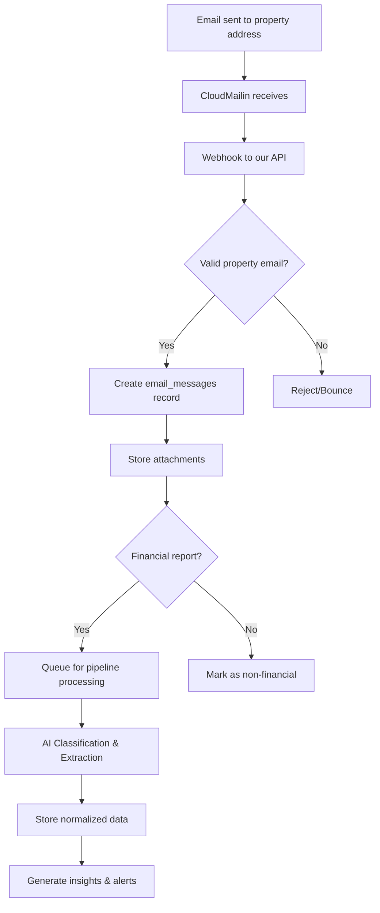

# 🏗️ Multi-Tenant Architecture Overview

## Hierarchy Structure

```
┌─────────────────────────────────────────────────────────────┐
│                         INVESTORS                             │
│  (Property Owners, REITs, Investment Firms, Individuals)     │
│                                                               │
│  • Acme Real Estate Investments LLC                          │
│  • John Smith Family Trust                                   │
│  • Sunset Properties REIT                                    │
└───────────────────┬─────────────────────────────────────────┘
                    │ owns multiple
                    ▼
┌─────────────────────────────────────────────────────────────┐
│                        PROPERTIES                             │
│          (Individual Assets/Buildings)                        │
│                                                               │
│  Investor: Acme Real Estate                                  │
│  ├── Sunset Tower (sunset-tower@reports.cloudmailin.net)    │
│  ├── Downtown Plaza (downtown-plaza@reports.cloudmailin.net) │
│  └── Harbor View Apts (harbor-view@reports.cloudmailin.net)  │
└───────────────────┬─────────────────────────────────────────┘
                    │ receives
                    ▼
┌─────────────────────────────────────────────────────────────┐
│                    EMAIL MESSAGES                             │
│              (Reports sent to properties)                     │
│                                                               │
│  To: sunset-tower@reports.cloudmailin.net                    │
│  From: accounting@propertymanager.com                        │
│  Subject: December 2024 Financial Report                      │
│  Attachments: [Dec_2024_Financials.xlsx]                     │
└───────────────────┬─────────────────────────────────────────┘
                    │ contains
                    ▼
┌─────────────────────────────────────────────────────────────┐
│                    ATTACHMENTS                                │
│            (Financial Reports to Process)                     │
│                                                               │
│  • Dec_2024_Financials.xlsx → Income Statement               │
│  • Q4_Operations.pdf → Operational Report                    │
│  • Balance_Sheet_2024.csv → Balance Sheet                    │
└───────────────────┬─────────────────────────────────────────┘
                    │ processed into
                    ▼
┌─────────────────────────────────────────────────────────────┐
│              NORMALIZED FINANCIAL DATA                        │
│                   (Clean, Structured)                         │
│                                                               │
│  Revenue: $850,000 | Expenses: $398,000 | NOI: $452,000     │
└─────────────────────────────────────────────────────────────┘
```

## Database Relationships

```sql
investors (1) ──────< (many) properties
    │                           │
    │                           │ each property has unique email
    │                           ▼
    │                    sunset-tower@reports.cloudmailin.net
    │                           │
    │                           │ receives emails
    │                           ▼
    └────< user_investor_access ──> users (many-to-many)
                                   
properties (1) ──────< (many) email_messages
    │                           │
    │                           └────< (many) email_attachments
    │                                          │
    │                                          │ processed by
    │                                          ▼
    └────< (many) financial_data_raw ──> financial_metrics
```

## 🔐 Access Control Model

### User Roles & Permissions

```typescript
interface UserAccess {
  investor_id: string;
  role: 'owner' | 'admin' | 'manager' | 'analyst' | 'viewer';
  property_access: string[] | null; // null = all properties
  permissions: {
    view_reports: boolean;
    upload_reports: boolean;
    edit_properties: boolean;
    manage_users: boolean;
    view_analytics: boolean;
    export_data: boolean;
  };
}
```

### Example Access Scenarios

1. **Owner Role**: Full access to all investor data and properties
2. **Property Manager**: Access to specific properties only
3. **Accountant**: View/upload reports for all properties, no edit access
4. **Analyst**: Read-only access to financial data and analytics

## 📧 Email Processing Flow



## 🚀 Implementation Example

### Setting Up a New Investor with Properties

```typescript
// 1. Create investor
const investor = await createInvestor({
  name: "Acme Real Estate Investments",
  entity_type: "llc",
  primary_email: "info@acme-re.com",
  subscription_tier: "professional"
});

// 2. Create properties
const properties = await Promise.all([
  createProperty({
    investor_id: investor.id,
    name: "Sunset Tower",
    property_type: "residential",
    address_line1: "123 Sunset Blvd",
    city: "Los Angeles",
    state: "CA",
    cloudmailin_address: "sunset-tower@reports.cloudmailin.net"
  }),
  createProperty({
    investor_id: investor.id,
    name: "Downtown Plaza",
    property_type: "commercial",
    // ... more details
  })
]);

// 3. Grant user access
await grantUserAccess({
  user_id: currentUser.id,
  investor_id: investor.id,
  role: "owner",
  property_access: null // Access to all properties
});
```

### Processing Emails for a Property

```typescript
// CloudMailin webhook handler
async function handleCloudMailinWebhook(payload: CloudMailinPayload) {
  // 1. Identify property from email address
  const property = await getPropertyByEmail(payload.envelope.to);
  
  if (!property) {
    return { status: 404, message: "Unknown property email" };
  }
  
  // 2. Store email message
  const email = await createEmailMessage({
    investor_id: property.investor_id,
    property_id: property.id,
    to_address: payload.envelope.to,
    from_address: payload.envelope.from,
    subject: payload.headers.subject,
    plain_body: payload.plain,
    html_body: payload.html,
    attachment_count: payload.attachments?.length || 0
  });
  
  // 3. Process attachments
  for (const attachment of payload.attachments || []) {
    const savedAttachment = await saveEmailAttachment(email.id, attachment);
    
    // 4. Check if financial report
    if (isFinancialReport(attachment)) {
      await queueForFinancialPipeline({
        attachment_id: savedAttachment.id,
        investor_id: property.investor_id,
        property_id: property.id
      });
    }
  }
  
  return { status: 200, message: "Email processed" };
}
```

## 🎯 Key Benefits of This Structure

1. **Clear Hierarchy**: Investors → Properties → Emails → Attachments
2. **Unique Emails per Property**: Each property gets its own CloudMailin address
3. **Flexible Access Control**: Users can access one or many investors/properties
4. **Audit Trail**: Complete tracking from email receipt to processed data
5. **Scalable**: Handles 1 investor with 1 property or 1000 investors with 1000s of properties

## 📊 Sample Queries

### Get all properties for an investor
```sql
SELECT * FROM properties 
WHERE investor_id = ? 
AND status = 'active'
ORDER BY name;
```

### Get recent emails for a property
```sql
SELECT 
  em.*,
  COUNT(ea.id) as attachment_count
FROM email_messages em
LEFT JOIN email_attachments ea ON ea.email_message_id = em.id
WHERE em.property_id = ?
GROUP BY em.id
ORDER BY em.received_at DESC
LIMIT 20;
```

### Get financial reports awaiting processing
```sql
SELECT 
  ea.*,
  em.subject,
  p.name as property_name,
  i.name as investor_name
FROM email_attachments ea
JOIN email_messages em ON em.id = ea.email_message_id
JOIN properties p ON p.id = em.property_id
JOIN investors i ON i.id = p.investor_id
WHERE ea.attachment_type = 'financial_report'
AND ea.is_processed = false
ORDER BY em.received_at ASC;
```

## 🔄 Next Steps

1. **Apply the migrations** in order:
   - `20250128160000_multi_tenant_foundation.sql`
   - `20250128161000_update_financial_tables.sql`

2. **Set up CloudMailin** webhook endpoint

3. **Create investor onboarding flow**

4. **Build property management interface**

5. **Connect email processing to financial pipeline**

---

**This structure provides a solid foundation for multi-tenant financial report processing that can scale from day one!** 🚀